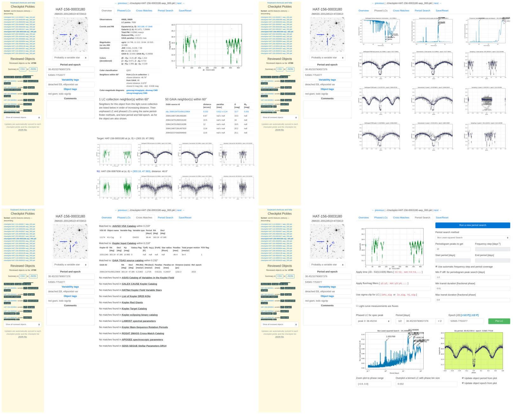

Astrobase
=========

Astrobase is a Python package for analyzing light curves and finding variable
stars. It includes implementations of several period-finding algorithms, batch
work drivers for working on large collections of light curves, as well as an
interactive webapp useful for reviewing and classifying light curves by stellar
variability type. This package was spun out of a bunch of Python modules I wrote
and maintain for my work with the `HAT Exoplanet Surveys
<https://hatsurveys.org>`_. It's applicable to many other astronomical
time-series observations, and includes support for the light curves produced by
Kepler and TESS in particular.

Most functions in this package that deal with light curves (e.g. in the modules
:py:mod:`astrobase.lcmath`, :py:mod:`astrobase.periodbase`,
:py:mod:`astrobase.varbase`, :py:mod:`astrobase.plotbase`,
:py:mod:`astrobase.checkplot`) usually just require three Numpy ndarrays as
input: `times`, `mags`, and `errs`, so they should work with any time-series
data that can be represented in this form. If you have flux time series
measurements, most functions take a `magsarefluxes` keyword argument that makes
them handle flux light curves correctly.

The :py:mod:`astrobase.lcproc` subpackage implements drivers for working on
large collections of light curve files, and includes functions to register your
own light curve format so that it gets recognized and can be worked on by other
Astrobase functions transparently.

- Guides for specific tasks are available as Jupyter notebooks at Github:
  `astrobase-notebooks <https://github.com/waqasbhatti/astrobase-notebooks/>`_.
- The :doc:`full API documentation </modules>` generated automatically from
  the docstrings by Sphinx is available.
- The code for Astrobase is maintained at `Github
  <https://github.com/waqasbhatti/astrobase>`_.

Install Astrobase from PyPI using `pip`::

  # preferably in a virtualenv

  # install Numpy to compile Fortran dependencies
  $ pip install numpy

  # install astrobase
  $ pip install astrobase

Package contents
================

.. toctree::
   :maxdepth: 1
   :caption: Handling light curve formats

   astrobase.astrokep
   astrobase.astrotess
   astrobase.hatsurveys

- :py:mod:`astrobase.astrokep`: contains functions for dealing with Kepler and
  K2 Mission light curves from STScI MAST (reading the FITS files, consolidating
  light curves for objects over quarters), and some basic operations (converting
  fluxes to mags, decorrelation of light curves, filtering light curves, and
  fitting object centroids for eclipse analysis, etc.)
- :py:mod:`astrobase.astrotess`: contains functions for dealing with TESS
  2-minute cadence light curves from STScI MAST (reading the FITS files,
  consolidating light curves for objects over sectors), and some basic
  operations (converting fluxes to mags, filtering light curves, etc.)
- :py:mod:`astrobase.hatsurveys`: modules to read, filter, and normalize light
  curves from various HAT surveys.

.. toctree::
   :maxdepth: 1
   :caption: Period-finding algorithms

   Box-Least-Squares (Astropy) <astrobase.periodbase.abls>
   Box-Least-Squares (eebls.f) <astrobase.periodbase.kbls>
   Phase dispersion minimization <astrobase.periodbase.spdm>
   Analysis-of-Variance <astrobase.periodbase.saov>
   Analysis-of-Variance multi-harmonic <astrobase.periodbase.smav>
   Generalized Lomb-Scargle <astrobase.periodbase.zgls>
   Auto-correlation <astrobase.periodbase.macf>

This package contains parallelized implementations of several period-finding
algorithms.

.. toctree::
   :maxdepth: 1
   :caption: Light curve operations

   astrobase.lcmath
   astrobase.lcmodels
   astrobase.varbase
   astrobase.plotbase
   astrobase.lcproc

- :py:mod:`astrobase.lcmath`: functions for light curve operations such as
  phasing, normalization, binning (in time and phase), sigma-clipping, external
  parameter decorrelation (EPD), etc.
- :py:mod:`astrobase.lcmodels`: modules that contain simple models for several
  variable star classes, including sinusoidal variables, eclipsing binaries, and
  transiting planets. Useful for fitting these with the functions in the
  :py:mod:`astrobase.varbase.lcfit` module.
- :py:mod:`astrobase.varbase`: functions for calculating variability indices for
  light curves, fitting and obtaining Fourier coefficients for use in
  classifications, and other variability features.
- :py:mod:`astrobase.plotbase`: functions to plot light curves, phased light
  curves, periodograms, and download Digitized Sky Survey cutouts from the NASA
  SkyView service.
- :py:mod:`astrobase.lcproc`: driver functions for running an end-to-end
  pipeline including: (i) object selection from a collection of light curves by
  position, cross-matching to external catalogs, or light curve objectinfo
  keys, (ii) running variability feature calculation and detection, (iii)
  running period-finding, and (iv) object review using the checkplotserver
  webapp for variability classification. This also contains an Amazon
  AWS-enabled `lcproc` implementation.

.. toctree::
   :maxdepth: 1
   :caption: Variable star classification

   astrobase.checkplot
   astrobase.cpserver
   astrobase.varclass
   astrobase.services

- :py:mod:`astrobase.checkplot`: contains functions to make checkplots: a grid
  of plots used to quickly decide if a period search for a possibly variable
  object was successful. Checkplots come in two forms:

  *Python pickles*: If you want to interactively browse through large numbers of
  checkplots (e.g., as part of a large variable star classification project),
  you can use the `checkplotserver` webapp that works on checkplot pickle
  files. This interface allows you to review all phased light curves from all
  period-finder methods applied, set and save variability tags, object type
  tags, best periods and epochs, and comments for each object using a
  browser-based UI (see below). The information entered can then be exported as
  CSV or JSON for the next stage of a variable star classification pipeline.

  *PNG images*: Alternatively, if you want to simply glance through lots of
  checkplots (e.g. for an initial look at a collection of light curves), there's
  a `checkplot-viewer` webapp available that operates on checkplot PNG images.

- :py:mod:`astrobase.cpserver`: contains the implementation of the
  `checkplotserver` webapp to review, edit, and export information from
  checkplot pickles produced as part of a variable star classification effort
  run on a large light curve collection. Also contains the more light-weight
  `checkplot-viewer` webapp to glance through large numbers of checkplot PNGs.
- :py:mod:`astrobase.varclass`: functions for calculating various variability,
  stellar color and motion, and neighbor proximity features, along with a Random
  Forest based classifier.
- :py:mod:`astrobase.services`: modules and functions to query various
  astronomical catalogs and data services, including GAIA, SIMBAD, TRILEGAL,
  NASA SkyView, and 2MASS DUST.

Other useful bits
-----------------

**Modules**

- :py:mod:`astrobase.coordutils`: functions for dealing with coordinates
  (conversions, distances, proper motion).
- :py:mod:`astrobase.timeutils`: functions for converting from Julian dates to
  Baryocentric Julian dates, and precessing coordinates between equinoxes and
  due to proper motion; this will automatically download and save the JPL
  ephemerides **de430.bsp** from JPL upon first import.

**Subpackages**

- :py:mod:`astrobase.fakelcs`: modules and functions to conduct an end-to-end
  variable star recovery simulation.

.. toctree::
   :maxdepth: 4
   :caption: Full API documentation

   modules

Installation
============

Requirements
------------

This package requires the following other packages:

- numpy
- scipy
- astropy
- matplotlib
- Pillow
- jplephem
- requests
- tornado
- pyeebls
- tqdm
- scikit-learn

For optional functionality, some additional packages from PyPI are required:

- To use the :py:mod:`astrobase.lcdb` module, you'll need `psycopg2-binary` or
  `psycopg2`.
- To use :py:func:`astrobase.varbase.lcfit.mandelagol_fit_magseries` for fitting
  Mandel-Agol planetary transit models, you'll need `batman-package`,
  `emcee`, `corner`, and `h5py`.
- To use the Amazon AWS enabled light curve work drivers in the
  :py:mod:`astrobase.lcproc.awsrun` module, you'll need `paramiko`, `boto3`, and
  `awscli`, as well as an AWS account.

Installing with pip
-------------------

If you're using:

- 64-bit Linux and Python 2.7, 3.4, 3.5, 3.6, 3.7
- 64-bit Mac OSX 10.12+ with Python 2.7 or 3.6
- 64-bit Windows with Python 2.7 and 3.6

You can simply install astrobase with::

  (venv)$ pip install astrobase

Otherwise, you'll need to make sure that a Fortran compiler and numpy are
installed beforehand to compile the pyeebls package that astrobase depends on::

  ## you'll need a Fortran compiler.                              ##
  ## on Linux: dnf/yum/apt install gcc gfortran                   ##
  ## on OSX (using homebrew): brew install gcc && brew link gcc   ##

  ## make sure numpy is installed as well!                        ##
  ## this is required for the pyeebls module installation         ##

  (venv)$ pip install numpy # in a virtualenv
  # or use dnf/yum/apt install numpy to install systemwide

Once that's done, install astrobase::

  (venv)$ pip install astrobase

Other installation methods
--------------------------

To Install all the optional dependencies as well::

  (venv)$ pip install astrobase[all]

To install the latest version (may be unstable at times)::

  $ git clone https://github.com/waqasbhatti/astrobase
  $ cd astrobase
  $ python setup.py install
  $ # or use pip install . to install requirements automatically
  $ # or use pip install -e . to install in develop mode along with requirements
  $ # or use pip install -e .[all] to install in develop mode along with all requirements

Citing Astrobase
================

`Released versions <https://github.com/waqasbhatti/astrobase/releases>`_ of
Astrobase are archived at `the Zenodo repository
<https://doi.org/10.5281/zenodo.1011188>`_. Zenodo provides a DOI that can be
cited for each specific version. The following `bibtex` entry for Astrobase
v0.3.8 may be useful as a template. You can substitute in values of `month`,
`year`, `version`, `doi`, and `url` for the version of `astrobase` you used for
your publication::

  @misc{wbhatti_astrobase,
        author       = {Waqas Bhatti and
                        Luke G. Bouma and
                        Joshua Wallace},
        title        = {\texttt{Astrobase}},
        month        = feb,
        year         = 2018,
        version      = {0.3.8},
        publisher    = {Zenodo},
        doi          = {10.5281/zenodo.1185231},
        url          = {https://doi.org/10.5281/zenodo.1185231}
  }

Alternatively, the following `bibtex` entry can be used for all versions of
Astrobase (the DOI will always resolve to the latest version)::

  @misc{wbhatti_astrobase,
        author       = {Waqas Bhatti and
                        Luke G. Bouma and
                        Joshua Wallace},
        title        = {\texttt{Astrobase}},
        month        = oct,
        year         = 2017,
        publisher    = {Zenodo},
        doi          = {10.5281/zenodo.1185231},
        url          = {https://doi.org/10.5281/zenodo.1185231}
  }

Also see this `AAS Journals note on citing repositories
<https://github.com/AASJournals/Tutorials/blob/master/Repositories/CitingRepositories.md>`_.

Period-finder algorithms
------------------------

If you use any of the period-finder methods implemented by
:py:mod:`astrobase.periodbase`, please also make sure to cite their respective
papers as well.

- the generalized Lomb-Scargle algorithm from Zechmeister & Kurster
  (`2008 <http://adsabs.harvard.edu/abs/2009A%26A...496..577Z>`_)
- the phase dispersion minimization algorithm from Stellingwerf
  (`1978 <http://adsabs.harvard.edu/abs/1978ApJ...224..953S>`_,
  `2011 <http://adsabs.harvard.edu/abs/2011rrls.conf...47S>`_)
- the AoV and AoV-multiharmonic algorithms from Schwarzenberg-Czerny
  (`1989 <http://adsabs.harvard.edu/abs/1989MNRAS.241..153S>`_,
  `1996 <http://adsabs.harvard.edu/abs/1996ApJ...460L.107S>`_)
- the BLS algorithm from Kovacs et
  al. (`2002 <http://adsabs.harvard.edu/abs/2002A%26A...391..369K>`_)
- the ACF period-finding algorithm from McQuillan et
  al. (`2013a <http://adsabs.harvard.edu/abs/2013MNRAS.432.1203M>`_,
  `2014 <http://adsabs.harvard.edu/abs/2014ApJS..211...24M>`_)

Changelog
=========

Please see https://github.com/waqasbhatti/astrobase/blob/master/CHANGELOG.md for
the latest changelog for tagged versions.

License
=======

Astrobase is provided under the MIT License. See the `LICENSE file
<https://github.com/waqasbhatti/astrobase/blob/master/LICENSE>`_ for the full
text.

Indices and tables
==================

* :ref:`genindex`
* :ref:`modindex`
* :ref:`search`
